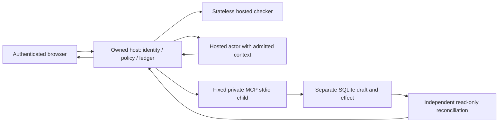

# ProofGate

Give AI useful autonomy while retaining enforceable control over data, actions and spending. **Blind Workbench** is the primary supplier-renewal scene: AI composes approved public operations, then the owned host applies confidential synthetic contracts and private rules locally to produce a useful negotiation brief. A separate employee action saves the exact current brief through typed MCP with independent SQLite read-back. The existing ProofLib 1.0.0→2.0.0 release assistant remains available as supporting regression evidence. The original Phase05 actual hosted proof is complete and strictly validated; the separate public-intention proof also passed. Current acceptance is established by the canonical phase verification and review reports, separately from these bounded observations.

Use Node **22.23.1**, npm **10.9.8**, and the exact installed/locked dependencies. A fresh builder runs:

```sh
npm ci --ignore-scripts
npm run build
npm test
export PROOFGATE_TOKEN="$(node -e 'process.stdout.write(require("crypto").randomBytes(24).toString("hex"))')"
# Privately copy this newly generated token for the browser Connect field.
# Run in your own terminal only; do not record, share or screenshot the value.
printf '%s\n' "$PROOFGATE_TOKEN"
npm start
```

`npm test` runs build and the full offline test glob, failing nonzero on either failure. It needs no ADC/provider network and includes intercepted SDK/model transports, actual private MCP stdio, unique temporary stores and independently reopened effects. Runner executions include imported duplicate registrations; they are not unique attacks. `npm run build` and `npm run eval:offline` remain separately available.

Open **http://127.0.0.1:3100**, enter the private gateway token and click **Connect**. Choose **Negotiation opportunities** or **Service risk priorities**, optionally enter a **public employee instruction / context**, then **Compose method**. Composition makes paid hosted calls: first confirm the finite allocation and remaining shared allowance with the root operator. All `/api/` routes require bearer authentication. The browser keeps the token in transient memory and clears the input after connection; refreshing requires reconnecting. The server listens only on loopback. Keep tokens out of Git, screenshots and exports.

Actual inference needs funded owned **authorized-user ADC**, established with `gcloud auth application-default login`, or an owned authorized-user ADC file selected via `GOOGLE_APPLICATION_CREDENTIALS`. The supported backend is Vertex AI project **hackathon-gdg-wroclaw**, **global**, actor **gemini-3.5-flash**, checker **gemini-3.5-flash-lite**. Service-account, federation and metadata credentials are rejected by the supported interception boundary. No organizer subscription or production-data clearance is assumed.

**Fresh install versus retained demo:** offline tests and packaged evidence need no model credentials. The source archive contains no saved runtime database or session: pasting a historical run ID into a fresh host returns `RUN_NOT_FOUND`. Interactive local rebind requires an actual method already admitted in that same owned host. On a fresh installation, compose it once using authorized hosted access and finite allowance before rebind/save. Inspect the supplied PDF, sanitized evidence and labeled backup without credentials; do not call that a newly executed interactive AI demonstration.

`PROOFGATE_HOST_DB` / `PROOFGATE_FIXTURE_DB` optionally select host/independent fixture stores; defaults are `.proofgate/host.sqlite` / `.proofgate/fixture.sqlite`. Preserve the existing stores, effects and epoch. Fresh runs never reset allowance. Unknown dispatched work stays charged and is not replayed. Restart/resume recovery is deferred. Root alone operates the current live server/stores/token and coordinates paid headroom; do not start another host against those stores.

`npm run eval:hosted` is **opt-in, paid and root-coordinated**, serialized with `--test-concurrency=1`. Missing ADC/model/headroom fails; no passing skips. Retained Phase02 approval snapshots are stale after policy restoration and cannot authorize reruns. Offline tests establish implementation behavior; dated actual hosted evidence establishes its narrow provider observations separately.

## Authenticated integration and configuration

The primary scene uses the independently specified synthetic fixture in `test/blind-intent-case.json`. Load `initial.records` into **Private contracts** and apply; load `initial.rules` into **Private decision rules** and apply. Choose **Negotiation opportunities** and paste the fixture's public `advisory`: “Within the next 60 days, prepare at most two renewal negotiations, earliest renewals first. Use the approved local operations. Prepare an internal negotiation brief for employee review.” Compose once under a reviewed finite allowance, or inspect the retained actual run. The admitted method must show 60 days, earliest first and at most two records. The initial independently expected Near/Middle brief totals **$130 potential annual savings**. Apply `mutated.records` and rebind; then apply `mutated.rules` and rebind again. The final expected Middle/Large brief totals **$1,060 potential annual savings** with zero new provider attempts during private recomputation. Attempt the labeled manual external export (refused, zero sink effects), then save the exact current internal brief and inspect independent read-back. These are negotiation targets and **potential savings, never achieved savings**. Reset restores the standard demonstration worksheet, not this experiment fixture; reload the fixture values to repeat this exact scene. Separate drafts survive other Apply actions; Stop observes status only and cannot interrupt acknowledged mutations. The existing standard 90-day scene and service-risk objective remain supporting examples. Actual AI choices must be inspected and admitted; never substitute a prepared recipe while calling it fresh composition.

The public objective and approved capability vocabulary are disclosed to the models. The existing optional `advisory` field is the employee’s public instruction/context: it reaches remote inspection, and admitted text reaches the planner. For example, “Consider renewals due within 60 days; keep the two earliest” requests a method within the existing capability contract. The separately validated actual experiment established this method choice and changed local result for one synthetic request; final phase acceptance is separate from that observation. Use public or synthetic text only. Arbitrary secrets pasted into this public field are not protected by the demonstrated worksheet boundary. Private supplier names/records, private rule bodies, computed briefs, local revisions and private-derived hashes are excluded from public request constructors and validated application captures. Models compose a bounded operation grammar (due window, targets, service evaluation, ranking, optional row limit, brief rendering); no generated code, SQL, arbitrary URLs or unrestricted tools are executed. Deterministic and enabled semantic controls both admit the whole recipe before private execution.

The UI shows exact actual SDK application-body captures separately from constructor specimens and OAuth/transport metadata. Injected SDK dispatch is labeled **offline**, hosted dispatch **live**, and historical/recorded evidence is labeled separately. Constructor equality is same-objective evidence; checker recipe-input equality refers to the same retained plan. Different stochastic composition requests need not produce identical recipes. Rebind retains the original recipe and application captures; the host attempt rows establish zero new auth/planner/checker work. Policy/feed changes require new composition rather than concealed model inspection.

| Blind request | Current contract |
| --- | --- |
| POST /api/blind/runs | Strict `{taskId:"negotiation-savings"\|"service-risk",advisory?:string}`; public advisory ≤4096 UTF-8 bytes; 202 `{runId}` |
| GET /api/blind/runs/:id | Owned current/stale result, revision, recipe, adapter mode, constructor samples, exact application captures, attempts, whole-epoch resources and separate save/independent observations |
| GET /api/blind/workspace | Authenticated synthetic private `{version,records,rules}` for the local employee UI |
| PUT /api/blind/private | `{expectedVersion,records}`; updates records only; current version increments |
| PUT /api/blind/rules | `{expectedVersion,rules}`; updates rules only; current version increments |
| POST /api/blind/runs/:id/rebind | `{}`; applies retained admitted recipe to the current local workspace with no provider work |
| POST /api/blind/runs/:id/save | `{resultRevision}`; only the server-issued current revision; a fresh registered save-only action in the same allowance epoch |
| GET /api/blind/artifacts/:id | Authenticated immutable private brief, revision/workspace/action provenance and exact `contentHash` |
| GET /api/blind/runs/:id/export | Strict sanitized `proofgate-blind-evidence-1`; GET-only observation with no dispatch/save |
| POST /api/blind/runs/:id/export | `{resultRevision,destination:"external"}`; explicitly labeled manual external-sink refusal with zero sink effects; distinct from sanitized GET export |
| POST /api/blind/reset | `{}`; resets synthetic worksheet at a higher workspace version; conserves ledger, attempts and historical artifacts |

A minimal integration supplies the same bearer-authenticated owned host contract as the UI. `gatewayToken` is a caller-provided transient secret; `publicInstruction` contains public text only. Starting composition spends allowance; GET observes without new work:

```js
async function api(path, method = 'GET', body) {
  const response = await fetch(`http://127.0.0.1:3100${path}`, {
    method,
    headers: { Authorization: `Bearer ${gatewayToken}`, 'Content-Type': 'application/json' },
    ...(body === undefined ? {} : { body: JSON.stringify(body) })
  });
  const value = await response.json();
  if (!response.ok) throw new Error(value.code || `HTTP_${response.status}`);
  return value;
}
const { runId } = await api('/api/blind/runs', 'POST', {
  taskId: 'negotiation-savings', advisory: publicInstruction
});
const observation = await api(`/api/blind/runs/${runId}`);
// Observe until state leaves running; only use a current server-issued resultRevision.
// api(`/api/blind/runs/${runId}/save`, 'POST', { resultRevision: observation.resultRevision });
```

Integrations configure the same centralized controls via `GET /api/policy` followed by `PUT /api/policy` with `{expectedVersion,policy}`. Copy the accepted snapshot, increment `policy.version` once, retain the current feed identity and change only supported fields. Admission checks current authority at dispatch; stale/invalid policy updates fail without resetting charges. The fixed host validates recipes and mediates fixed MCP tools; this API does not turn arbitrary existing agent/tool traffic into governed traffic automatically.

Mutations invalidate old result ownership until current rebind. Save registers a fresh action/deadline without changing the original composition deadline; only tool authority is granted to that action. Host acknowledgement, unknown/pending outcome, observed count and exact independent match remain distinct. Unknown dispatched save work remains charged and cannot be replayed, even if a separate recorder finds an effect. Missing/unreadable recorder means **unavailable**, never observed zero. The UI separately fetches the authenticated artifact and checks exact private content/hash; public export contains only bounded opaque internal-save hashes, never private brief content. Wrong workflow status/export routes reject before the other workflow's projection or observer.

`proofgate-blind-evidence-1` exports allowlisted objective/recipe, approved exact public captures tied to metered attempt IDs and mode, current policy/feed hashes and admitted basis, known decision reasons, composition/save attempts, whole-epoch accounting, observed token categories and nullable estimated tariff, independent effects and separated measured spans. Deterministic, advisory checker, recipe checker, planner, local executor, MCP and overall timings retain actual monotonic start/end boundaries, sample/aggregate counts and hardware/model identity. Nested timings are not added into a fabricated total; uninstrumented historical timings remain unavailable. Private records/names/rules/results, arbitrary event/verdict/operator text, raw reasoning, headers and OAuth credentials are omitted; polluted public captures fail closed. Bounded downloads retain the Blob until browser consumption and then release it. Retained inspection/download use authenticated GET only.

For a reproducible local demonstration reset, use **Reset synthetic worksheet**, then inspect a known actual retained Blind run and **Rebind locally**. Reset restores the initial synthetic records/rules at a higher version and invalidates the prior current result. It preserves historical artifacts, charged attempts and the shared epoch; do not delete databases. Rebind starts no provider work, while each new internal save consumes tool allowance. Retained run IDs for the original actual proof are documented in [rehearsal.md](submission/rehearsal.md). Policy/feed changes require new composition; reset cannot make a stale policy basis current. Stop observing ends polling only, so verify action state before shutdown rather than assuming cancellation. Restart/resume guarantees remain deferred.

**Supporting release assistant** opens the preserved Clean/Hostile/Missing scene and **Prepare draft** controls. The existing API and `proofgate-evidence-1` schema below retain their release-specific contracts.

```sh
curl --fail --silent --show-error -H "Authorization: Bearer $PROOFGATE_TOKEN" http://127.0.0.1:3100/api/policy
curl --fail --silent --show-error -H "Authorization: Bearer $PROOFGATE_TOKEN" -H "Content-Type: application/json" -d '{"scenario":"clean"}' http://127.0.0.1:3100/api/runs
# Replace RUN_ID with the returned runId; GET requests observe existing work.
curl --fail --silent --show-error -H "Authorization: Bearer $PROOFGATE_TOKEN" http://127.0.0.1:3100/api/runs/RUN_ID
curl --fail --silent --show-error -H "Authorization: Bearer $PROOFGATE_TOKEN" http://127.0.0.1:3100/api/runs/RUN_ID/export -o proofgate-export.json
```

Starting a live run spends shared allowance; run only with reviewed headroom. The UI also downloads authenticated canonical export. The `proofgate-evidence-1` contract includes allowlisted run/events/attempts/current accepted policy/feed, whole-epoch call/credit totals, nullable observed token categories/tariff and independent effects. Measurements separate deterministic, checker, actor, MCP and overall wall spans with boundaries, workload, hardware and requested/returned model identity. Historical unmeasured durations stay unavailable. Export uses a separate 256KiB control response bound.

| Request | Contract |
| --- | --- |
| POST /api/runs | Strict `{scenario:"clean"\|"hostile"\|"missing", advisory?:string}`; optional advisory ≤4096 UTF-8 bytes; 202 `{runId}` |
| GET /api/runs/:id | Owned sanitized state/draft/decisions/resources/independent-effects/audit projection |
| GET /api/runs/:id/export | Owned sanitized canonical evidence JSON; no raw reasoning or credential fields |
| GET /api/policy, GET /api/feed | Current accepted snapshots |
| PUT /api/policy | `{expectedVersion,policy}`; candidate version = captured version + 1, feedVersion = current feed |
| PUT /api/feed | `{expectedVersion,feed}`; candidate version = captured version + 1; bounded literal signatures, never regex/code |

Supply bearer authentication and JSON Content-Type for mutations. HTTP401 rejects missing auth; HTTP400 invalid schema/bounds; HTTP409 stale candidate; HTTP503 `RUN_CAPACITY` rejects excess work before a run/effect/dispatch/charge. Four active workflows and zero queued workflows are supported, including occupancy during MCP cleanup.

`config/policy.json` / `config/signatures.json` seed a fresh store only. Capture the current authenticated snapshot, copy it, increment version exactly once and activate via the expected-version API. Feed activation also advances policy identity. Invalid/stale changes retain accepted snapshots, usage and epoch. **Configure controls** remains usable while observing. **Stop observing** stops browser polling; host work may continue charged. The 130-second browser observation timeout does not imply host cancellation or automatic retry. UTF-8 length feedback rejects oversized advisory before POST.

Controls cover semantic/signature enablement, supported PII Block/Redact, confidence threshold, model allowlist, provider/internal-sink permission and finite budgets. Semantic allow never overrides deterministic denial; Redact never declassifies audiences. Independent `strictness` and `controls.flow` are reserved compatibility metadata with disabled UI selectors; structural ownership/provenance/audiences/internal-only boundaries stay enforced.

Initial standard profile: **64MiB conservative admission credits / 64 calls**, **16 calls / 8 actor turns / 120s** per run, **25s** attempt, **64KiB** request, **256KiB** response/error, **16KiB** JSON/opaque signature, **16 parts**, actor **2048** / checker **256** declared output tokens. Restricted profile: threshold **0.95**, **16MiB / 32 calls**, **6 turns / 90s**, actor **1536** output tokens. Maximum editable shared ceilings are 512 calls / 128MiB; changing ceilings preserves charges.

Every actual OAuth/model/MCP dispatch shares admission, including auth/catalog/explicit attempts. Credits reserve serialized request + response allowance + 16 bytes per declared output token; observed prompt/output/thought/cache categories and nullable tariff estimates are separate. No exact token quota or invoice guarantee. Proven-unsent reservation releases once; dispatched unknown cannot become unsent. Dispatch rechecks current authority and caps, including policy changed during awaits. Finite SQLite waits and transport/deadline bounds handle contention without automatically replaying work.

## Useful result, evidence and limits



The host owns run/caller/source/transcript/audiences/sinks. The actor proposes strict notes→independent facts→save/incomplete actions. Only three fixed fixture tools exist, with strict catalogs/arguments/results. The child receives no gateway/provider credentials. The host validates migration facts against an independent fixture oracle and renders canonical preparation-only text; arbitrary generated body/breakingChange prose is rejected.

Clean/Hostile results retain **configure→configureAsync; await initialization** and admitted clean citations. A hostile advisory is quarantined whole before actor exposure. Missing essential facts produces incomplete and zero effects. A saved badge requires one independently reconciled exact internal draft. Replay establishes no new live save; unknown/error/stopped-observation modes remain distinct. This prepares a draft only: it proves no dependency installation, test execution or deployment.

Accepted prior-phase evidence and source revisions are retained in the phase VERIFICATION/REVIEW artifacts. [Phase02 actual evidence](.planning/phases/02-hybrid-threat-and-data-controls/LIVE-EVIDENCE.md) records four frozen subjects × one actual checker attempt and two actual hosted on/off arms × one each. Both arms saved one exact independently confirmed internal draft; inspection changed advisory exposure with **no observed downstream causal benefit**. All failures/charges remain retained. This establishes no universal safety/general accuracy. Raw local evidence/stores remain ignored and excluded from the submission archive.

Local compute/time admission is a conceptual extension; there is one supported operational hosted backend and no local inference backend. The challenge brief expects local models; this hosted-only implementation is a disclosed gap, with no organizer approval claimed. “Local” means the company-controlled Node host, worksheet/interpreter and SQLite stores; it does not mean a local LLM. Public objectives/capability vocabulary remain visible to hosted models, so the proof does not conceal all company know-how or establish formal noninterference. Distributed capacity, arbitrary shell/general MCP federation, restart recovery and production certification remain deferred.

## Local English delivery

[Submission metadata](submission/submission.json) contains the exact five-word title, ≤500-word English description, the four genuine [team members](TEAM.md), setup/API/demo prerequisites, the baseline 21-requirement and five-requirement pivot evidence matrices and actual third-party inventory. No individual code contribution/account/email field is invented. Phase04 records retain their historical evidence. Current baseline and pivot acceptance requires substantive reassessment, root regression, independent review and current canonical verification; the original Phase05 hosted proof passed its separate strict validator.

```sh
node scripts/check-delivery.mjs --stage metadata
# After root supplies sanitized final evidence/captures and local PDF/content:
# Set PROOFGATE_ARTIFACT_PYTHON to the bundled Python returned by the
# workspace dependency loader (pypdf, PIL and reportlab), then:
node scripts/check-delivery.mjs --stage content
node scripts/check-delivery.mjs --stage release
```

Metadata is independent of final assets. Content requires actual final live exports, same epoch/source/capture/rehearsal identities, actual browser matrix, matching diagram/screenshot and readable landscape PDF≤10 slides. Missing assets/tooling fail nonzero. Release also verifies the exact sorted nine-file SHA256 manifest and ten-entry ZIP payload, extracting into a unique temporary directory and rejecting unsafe/extra/mismatched entries. Final local assets are present and independently inspected; their dated evidence remains labeled. The recorded backup must be genuinely dated and states no new live save.

Working-demo target: **4 October 2026 08:00 Warsaw**; rehearsal/polish **08:00–11:00**; final **11:00**. Targets are not completion claims. Brief/rules timing/scoring conflicts remain in [TASK-CONTRACT](goldman/TASK-CONTRACT.md).

Installed package directories retain their license notices; metadata records 7 direct exact pins and all 176 resolved production package locations with actual identifiers/notice hashes. `package-lock.json` preserves resolved integrity. Missing top-level notices are labeled by empty notice lists, not invented. No project open-source license is assigned; owner decision remains pending.

Root completes final regression, clean REVIEW, security/UI/source/all-26-requirement audit and canonical verification parser before phase acceptance. Deployment target/exposure/account access and submission authorization remain unsettled. No publication, external messaging, submission, production-data use or Git push is authorized by this local delivery.

## Actual proof, accounting and current acceptance

The original Phase05 actual proof is complete: four frozen public semantic observations, two actual model-composed objectives, private quote/rule rebinds matching an independent arithmetic oracle, zero added provider attempts during rebind, denied stale saves/manual external export with zero forbidden effects, and exact independently observed internal saves. The strict validator passed the dated `.proofgate/phase05-proof/result.json`. [Sanitized actual evidence](submission/evidence.json) preserves its observations and limitations. Four observations are not a classifier accuracy benchmark; two prepared objectives alone do not establish usefulness for an unprepared employee intention.

The original proof charged **24 attempts / 6502120 conservative admission credits**. Three later automated retained-plan walkthroughs charged **12 additional MCP tool attempts / 3150704 credits**, giving **36 combined attempts / 9652824 credits**. These are mixed auth/model/tool attempts, not 36 model calls. The original combined 32-attempt forecast was exceeded because each walkthrough save required four tool attempts. The proof alone fit its 32-attempt / 11534336-credit gate. Preserve this overrun; do not describe a revised forecast as retroactive authorization. These dated deltas are not the current live allowance after subsequent work.

The **three earlier automated browser walkthroughs** reused an actual retained plan and performed local changes/new internal saves; they did not establish fresh model composition or human five-minute timing. The recorded backup is a paced sequence of real captures, not a continuous live recording or new live save. The fourth automated walkthrough used the actual new 60-day method and reached $130 / $1,060 with zero new provider attempts. The total is **four automated walkthroughs and zero human rehearsals**. Details and dated observations are in [rehearsal.md](submission/rehearsal.md).

The separate public-intention experiment **passed actual root execution and strict validation**. The employee’s unprepared public instruction requested renewals within 60 days and the two earliest. Actual AI selected `select_due(60)` → `calculate_targets` → `rank(soonest)` → `take(2)` → `render`. An independently specified synthetic fixture yielded Near/Middle with **$130 potential savings**; private changes yielded Middle/Large with **$1060 potential savings**, matching independent expected arithmetic. Rebind added **zero provider attempts** and retained exact captured public body bytes; one internal save matched independently read exact bytes. This establishes useful bounded composition for that request, not superiority over spreadsheets/forms or general task intelligence. The result is retained at `.proofgate/phase05-intent-proof/result.json`, with a dated sanitized handoff at `.proofgate/phase05-delivery-input/intention-summary.json`. Its separately allocated ceiling was **12 attempts / 4325376 credits**; actual charges were **8 attempts / 2150481 credits**: three model, one auth and four MCP attempts. These later charges are separate from the original 36/32 forecast overrun and do not erase it. Current UI/browser, final review, security/source/requirement audit, package and canonical verification gates are recorded independently. Do not infer acceptance from completed implementation or prior-phase acceptance.

### Retained proof and paid operator boundary

Validation of the existing original proof is read-only and starts no hosted work:

```sh
node scripts/check-blind-proof.mjs --input .proofgate/phase05-proof/result.json
```

The original root-only hosted command is retained for reproducibility; **do not rerun completed proof**. A new paid experiment needs a concrete unresolved criterion, reviewed source and an explicit finite allocation within existing authorization/headroom. Preserve existing output and unknown attempts; neither a new run nor worksheet reset replenishes the epoch.

```sh
# Historical original proof command; root-only, paid, not a reset/replay step:
PROOFGATE_LIVE=1 PROOFGATE_BLIND_ROOT=1 node --test --test-concurrency=1 dist/test/hosted/blind.test.js
```

For an explicitly allocated new run, the root must own the sole listener and retained stores. The original runner refuses an occupied port 3100 and requires additive Blind tables in the retained fixture store. Its original reviewed preflight command was:

```sh
PROOFGATE_LIVE=1 PROOFGATE_BLIND_ROOT=1 node scripts/check-blind-proof.mjs --preflight
```

Preflight is a read-only approval snapshot, not permission to spend or overwrite previous approval. Missing reviewed source, ADC, same-epoch headroom or proof artifacts fail closed. Do not use the full hosted test glob as a substitute for a bounded allocation. Credentials stay private and synthetic data is mandatory.

`submission/evidence.json`, `submission/workbench.png`, `submission/rehearsal.md` and the English local package must match the final actual source/observations. The PDF remains limited to ten readable slides. Root requires current `.planning/phases/05-blind-workbench/REVIEW.md` and the installed parser’s `status: passed` for `05-VERIFICATION.md` before phase acceptance. Exact manifest/archive validation remains required. No publication, deployment, submission, messaging, production-data access or Git push is authorized.

## Reproducible source delivery

The nine-asset presentation package is accompanied by a separate credential-free source archive. [Delivery instructions](delivery/README.md) describe locked installation, build and offline checks after extraction. The archive includes application source, configuration, UI, tests, required documentary evidence and dependency notices; it excludes `.proofgate`, authentication tokens, provider credentials, live databases and `node_modules`. Final fresh-extraction acceptance is reported only after those commands actually pass. Hosted composition requires separately provisioned, authorized provider access; offline tests use disclosed synthetic adapters. Local release validation additionally requires the installed canonical GSD parser and current accepted review/verification reports, and fails closed without them.
